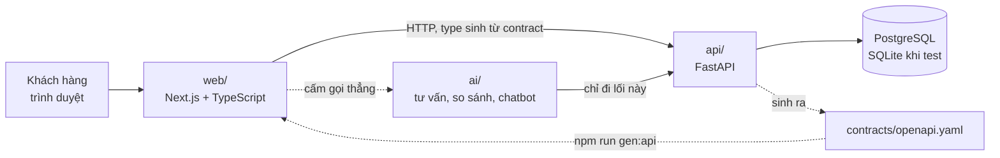

# Kiến trúc IFast

Tài liệu này mô tả **hiện trạng**, không mô tả dự định. Mỗi khẳng định về hành
vi đều truy được về một file trong cây mã nguồn. Thứ chưa tồn tại được ghi rõ là
chưa tồn tại.

Liên quan: [decision 0001](decisions/0001-team-roles-and-ownership-boundaries.md)
(phân vai) · [PRD backend](product/backend-prd.md) · [PRD web](product/web-prd.md)
· [mô hình dữ liệu](product/data-model.md) · [quy ước API](product/api-conventions.md).

## 1. Toàn cảnh



Bốn thành phần, mỗi thành phần một chủ theo decision 0001:

| Thành phần | Vai trò | Trạng thái |
| --- | --- | --- |
| `api/` | Toàn bộ quy tắc nghiệp vụ và mọi phép tính tiền | 5 domain chạy được, 7 domain mới là stub |
| `web/` | Giao diện khách hàng | 2 trang, **chưa từng chạy cùng `api/`** |
| `ai/` | Tư vấn, so sánh, chatbot | Cổng ra và tầng công cụ xong; **chưa có adapter nhà cung cấp thật** |
| `infra/` | Docker, CSDL, CI | compose và CI có; **chưa chạy thật trên PostgreSQL** |

## 2. Bốn đường may và cơ chế giữ

Đường may là chỗ hai người phải đồng ý với nhau. Mỗi đường may ở đây có một cơ
chế máy móc giữ, không chỉ có thoả thuận miệng.

| # | Đường may | Cơ chế giữ |
| --- | --- | --- |
| 1 | `contracts/openapi.yaml` giữa backend và frontend | Sinh từ code bằng `scripts/generate-contract.py`; CI chạy `--check` và fail khi lệch |
| 2 | Snapshot đơn hàng giữa `pricing/` và `orders/` | `orders/` không import gì từ `pricing/` lúc đọc đơn; `api/tests/test_orders_snapshot.py` |
| 3 | `ai/` chỉ nói chuyện với `api/` | `ai/tools.py` không có hàm tính tiền; `ai/evals/test_guardrails.py` quét mã nguồn |
| 4 | CI giữa R4a và R4b | `.github/CODEOWNERS` gán `.github/workflows/` cho R4a |

## 3. Bốn bất biến xuyên suốt domain

Đây là phần quan trọng nhất của kiến trúc này. Cả bốn đều có một file chịu trách
nhiệm thi hành, chứ không nằm rải rác trong quy ước.

### Bất biến 1 — mọi con số là một hàm của thời gian

Mọi bảng giá và bảng chính sách có `effective_from` / `effective_to`; mọi hàm
tính tiền nhận `as_of: date`.

Nơi thi hành: `api/core/effective.py`. Protocol `Effective` định nghĩa khoảng
hiệu lực; `latest_effective_on()` chọn bản ghi phủ mốc thời gian, ưu tiên bản bắt
đầu muộn nhất, và **trả `None` khi không có bản nào** — gọi hàm phải xử lý
`None`, không được mặc định về 0.

Ví dụ khó nhất là công thức bồi thường pin: giá pin `A` tra tại *thời điểm xảy ra
sự cố*, thời gian bảo hành `T2` tra tại *thời điểm hình thành tài sản*. Hai mốc
khác nhau trong cùng một công thức — một hàm chỉ biết "hiện tại" không diễn đạt
được nghiệp vụ này.

### Bất biến 2 — tiền là số nguyên đồng

Nơi thi hành: `api/core/money.py`. `Vnd = int`. Tỉ lệ dùng `Decimal`, và chỉ quy
về số nguyên ở bước cuối bằng `to_vnd()` với `ROUND_HALF_UP`. Không dùng `float`
cho tiền ở bất kỳ đâu.

Đại lượng thập phân của người dùng nhập cũng tránh `float`: mức tiêu thụ truyền
vào dưới dạng nhân 10, hậu tố `_x10` (6,5 lít/100km → `65`).

### Bất biến 3 — đơn đã chốt giữ snapshot

Nơi thi hành: `api/orders/`. Lúc tạo đơn, `build_snapshot()` đóng băng giá, ưu
đãi đã áp, phần tách khoản lăn bánh, và mốc `as_of` vào cột JSON
`orders_order.price_snapshot`. Sau đó đơn không đọc lại bảng giá.

`order_total_on(order, _as_of)` cố ý nhận một tham số thời gian **không dùng
đến**: nó có mặt để chỗ gọi không bị cám dỗ đi tra bảng giá, và câu trả lời độc
lập với nó chính là điều cần đảm bảo.

Bất biến này phục vụ hai mục tiêu cùng lúc: bảng giá đổi ngày mai không làm đổi
đơn ký hôm nay (nghiệp vụ), và `orders/` không phụ thuộc runtime vào `pricing/`
nên R2b sửa đơn hàng mà không phải chờ R2a (tổ chức).

### Bất biến 4 — mọi con số mang theo nguồn

Nơi thi hành: `ai/tools.py`. `ToolResult` bắt buộc có `value`, `source`, `as_of`.
`source` trỏ về bản ghi cụ thể đã dùng. Không có nguồn thì câu trả lời không
được chứa con số.

Cùng tinh thần đó ở tầng API: `OnRoadQuote` luôn kèm phần tách khoản;
`CompensationBreakdown` trả kèm giá đã dùng, ngày của giá, chính sách đã dùng, và
cờ `floor_applied`; `RunningCostComparison` trả kèm ngày hiệu lực của giá điện và
giá nhiên liệu.

Khi chưa cấu hình nhà cung cấp mô hình, `ai/ports.py` dùng `UnconfiguredLlm` ném
`NotConfigured` — **im lặng hỏng còn hơn trả lời bừa**, vì một câu trả lời sai về
giá xe là rủi ro pháp lý chứ không phải lỗi hiển thị.

## 4. Kiến trúc bên trong `api/`

### Chia theo domain dọc, không chia theo tầng

Mỗi domain sở hữu trọn `models.py` + `service.py` + `router.py` + test + migration
của bảng thuộc domain đó. Một feature = một domain = một PR = một người.

Chia theo tầng (một người model, một người API) khiến mọi feature cần cả hai
người sửa, và conflict ở mọi PR. Xem phần Alternatives của decision 0001.

### Ba lớp trong một domain

| Lớp | File | Trách nhiệm | Ràng buộc |
| --- | --- | --- | --- |
| Model | `models.py` | Ánh xạ bảng, enum của domain | Không chứa logic tính toán |
| Service | `service.py` | Toàn bộ quy tắc nghiệp vụ | **Hàm thuần**: nhận dữ liệu qua tham số, không tự truy vấn CSDL, không biết HTTP |
| Router | `router.py` | Đọc dữ liệu, gọi service, ánh xạ lỗi sang HTTP | Không chứa quy tắc nghiệp vụ |

Ràng buộc "service là hàm thuần" là thứ làm cho quy tắc nghiệp vụ khó test trở
nên dễ test: `api/tests/test_pricing.py`, `test_promotions.py`,
`test_battery_compensation.py` dựng dữ liệu bằng tay rồi gọi thẳng service, không
cần CSDL và không cần HTTP.

Ngoại lệ có chủ ý: `catalog/` không có `service.py` vì domain này chỉ đọc và ánh
xạ, không có quy tắc nào để tách ra.

### Vòng đời một request

`GET /pricing/on-road?trim_id=1&province_code=HN`, theo `api/pricing/router.py`:

```
router đọc 3 bảng (PriceBookEntry, RegistrationFeeSchedule, Promotion)
  → as_of = tham số, hoặc today() theo giờ Việt Nam nếu bỏ trống
  → resolve_price()         chọn bảng giá hiệu lực; không có thì PricingUnavailable
  → resolve_promotions()    chọn tập ưu đãi và tính tổng giảm
  → quote_on_road_cost()    lệ phí trước bạ tính trên giá SAU khi trừ ưu đãi
  → OnRoadQuoteOut          tổng + 7 khoản tách + danh sách ưu đãi đã áp
```

Thứ tự này không đổi chỗ được: lệ phí trước bạ tính trên giá sau ưu đãi, nên ưu
đãi phải được chốt trước khi tính phí. Tính trên giá niêm yết sẽ khiến khách phải
trả nhiều hơn thực tế.

`POST /orders` đi qua đúng ba bước trên rồi gọi `create_order()` để đóng băng kết
quả — đó là lý do đơn và báo giá không bao giờ lệch nhau tại thời điểm tạo.

### Entrypoint là append-only

`api/main.py` đăng ký router theo khối chỉ được thêm dòng ở cuối. Sắp xếp lại
danh sách đó là nguồn conflict cố định giữa hai người backend.

## 5. Dữ liệu

13 bảng, chi tiết trong [mô hình dữ liệu](product/data-model.md). Ba nhóm theo
cách dùng: bảng thực thể, bảng chính sách có khoảng hiệu lực, và bảng snapshot.

`api/core/db.py` đọc `IFAST_DATABASE_URL`; mặc định là SQLite trong thư mục dự án.
PostgreSQL khi chạy thật, SQLite khi chạy test — test không được phụ thuộc Docker,
nếu không sẽ không ai chạy test.

Migration bằng Alembic. Migration đầu tiên chạy được cả upgrade lẫn downgrade,
**mới kiểm chứng trên SQLite**.

## 6. Triển khai

`infra/docker-compose.yml`: PostgreSQL 16 có healthcheck, và service `api` build
từ `infra/Dockerfile.api`. Không có bí mật thật trong file này — repo đang public.

CI (`.github/workflows/ci.yml`) có hai job: job `api` chạy pytest, kiểm contract,
và ruff; job `secrets` quét bí mật trong toàn bộ lịch sử bằng gitleaks.

**Chưa chứng minh:** `docker compose up` chưa từng chạy thật, migration chưa từng
chạy trên PostgreSQL. Đây là việc số 4 còn treo trong
[plan P1](plans/active/p1-nen-tang-ban-xe.md).

## 7. Những gì kiến trúc này chưa có

Ghi ở đây để không ai tưởng là đã có:

- **Không có xác thực.** `POST /orders` hiện ai gọi cũng được. Xem
  [SECURITY.md](SECURITY.md).
- **Không có tầng cache.** Mọi request đọc thẳng CSDL.
- **Không có hàng đợi, không có tác vụ nền.** Thông báo và thanh toán sẽ cần.
- **Không có phân trang.** `GET /catalog/models` trả toàn bộ.
- **Không có mã lỗi máy đọc được.** Lỗi chỉ có `detail` là câu tiếng Việt.
- **Không có quan trắc.** Không log có cấu trúc, không metric, không trace.

Mỗi mục ở trên là một chính sách quan sát được từ bên ngoài, nên cần authority
trước khi thêm. Đừng tự chọn mặc định — xem
[PRD backend mục câu hỏi mở](product/backend-prd.md).
