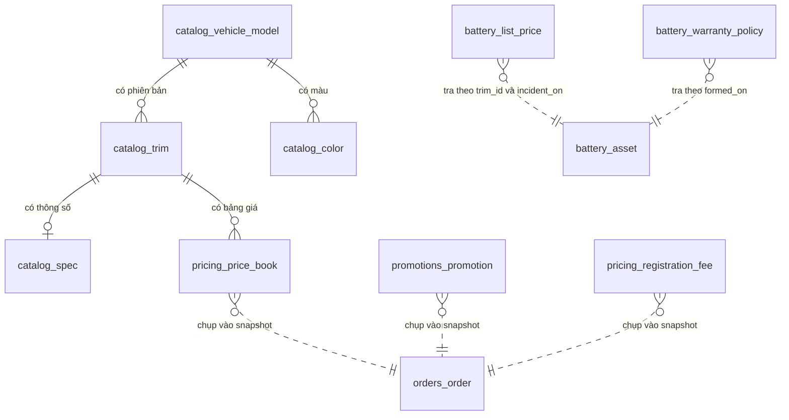

# Mô hình dữ liệu

Chủ sở hữu: R2a cho bảng `catalog_*`, `pricing_*`, `promotions_*`, `battery_*`;
R2b cho `orders_*`. Xem [decision 0001](../decisions/0001-team-roles-and-ownership-boundaries.md).

13 bảng, tất cả đã chạy được. Bảng cho bảy module stub chưa tồn tại.

Liên quan: [ARCHITECTURE.md](../ARCHITECTURE.md) · [PRD backend](backend-prd.md)
· [quy ước API](api-conventions.md) · [từ điển thuật ngữ](glossary.md).

## 1. Ba nhóm bảng theo cách dùng

Phân loại này quan trọng hơn việc bảng thuộc domain nào, vì nó quyết định cách
đọc bảng đó.

| Nhóm | Đặc điểm | Cách đọc | Bảng |
| --- | --- | --- | --- |
| **Thực thể** | Mô tả một vật có thật | Đọc thẳng theo khoá | `catalog_vehicle_model`, `catalog_trim`, `catalog_color`, `catalog_spec`, `battery_asset` |
| **Chính sách** | Có `effective_from` / `effective_to` | **Luôn qua `latest_effective_on(records, as_of)`** | `pricing_price_book`, `pricing_registration_fee`, `pricing_fuel_price`, `pricing_electricity_price`, `promotions_promotion`, `battery_warranty_policy`, `battery_list_price` |
| **Snapshot** | Đóng băng kết quả tại một thời điểm | Đọc nguyên trạng, không tính lại | `orders_order` (cột `price_snapshot`) |

Đọc một bảng chính sách bằng `SELECT ... ORDER BY id DESC LIMIT 1` là sai. Bảng
chính sách không có "bản ghi hiện tại" — nó có bản ghi *hiệu lực tại một mốc thời
gian*, và mốc đó do người gọi truyền vào.

## 2. Sơ đồ quan hệ



Nét đứt là **quan hệ logic, không phải khoá ngoại**. `orders_order` không có khoá
ngoại tới `pricing_price_book`: đơn chụp giá trị vào JSON rồi ngắt liên hệ. Đó là
bất biến 3, không phải thiếu sót thiết kế.

Tương tự, `promotions_promotion.trim_id` và `battery_list_price.trim_id` là
`Integer` chứ không phải `ForeignKey` — chúng là **điều kiện lọc**, cho phép
`NULL` nghĩa là "áp cho mọi phiên bản".

## 3. Bảng theo domain

### `catalog_*` — bán cái gì (R2a)

| Bảng | Khoá tự nhiên | Ghi chú |
| --- | --- | --- |
| `catalog_vehicle_model` | `code` unique | `category` là `car` hoặc `motorbike`; hai loại đo bằng đơn vị khác nhau |
| `catalog_trim` | `(model_id, code)` unique | Giá gắn ở đây, không gắn ở dòng xe |
| `catalog_color` | `(model_id, code, exterior)` unique | `exterior` phân biệt màu ngoại thất và nội thất |
| `catalog_spec` | `trim_id` unique | Mười cột thông số, mỗi đại lượng một cột có kiểu |

`catalog_spec` cho phép NULL ở mọi cột thông số vì ô tô và xe máy không dùng
chung tập đại lượng (ô tô: kW và km NEDC; xe máy: W và km mỗi lần sạc). **Không
bao giờ nhét thông số vào một cột văn bản** — `ai/` đọc trực tiếp schema này.

Hai cột dùng quy ước nhân 10 để tránh số thực: `battery_capacity_kwh_x10`,
`consumption_kwh_per_100km_x10`.

### `pricing_*` — giá bao nhiêu (R2a)

| Bảng | Khoá lọc | Ghi chú |
| --- | --- | --- |
| `pricing_price_book` | `trim_id` + `ownership_model` | `monthly_battery_fee_vnd` chỉ có nghĩa với mô hình thuê pin |
| `pricing_registration_fee` | `province_code` | Sáu khoản phí + `registration_tax_rate` kiểu `Numeric(6,4)` |
| `pricing_fuel_price` | `fuel_type` + `region_code` | Cho vế xe xăng dầu trong phép so sánh |
| `pricing_electricity_price` | `region_code` | Cho vế xe điện |

Cả bốn đều là bảng chính sách. `registration_tax_rate` là `Numeric`, không phải
`Float` — tỉ lệ phần trăm nhân với tiền phải giữ độ chính xác `Decimal`.

> **Cảnh báo dữ liệu.** Giá trị nạp bởi `api/seed.py` là **dữ liệu mẫu để chạy
> được, chưa phải số liệu pháp lý đã đối chiếu**. Phải thay trước khi lên
> production — câu hỏi Q-B2 trong [PRD backend](backend-prd.md).

### `promotions_promotion` — ưu đãi (R2a)

Một bảng, nhưng là bảng phức tạp nhất về mặt luật.

- Ba loại: `fixed_amount`, `percent_of_price`, `benefit_in_kind`.
- Ba cột điều kiện, tất cả cho phép NULL nghĩa là "không giới hạn": `trim_id`,
  `province_code`, `ownership_model`.
- Hai cột điều khiển luật ưu tiên: `priority` và `stackable`.
- Khoảng hiệu lực như mọi bảng chính sách khác.

Một cột `discount` trên bảng giá không diễn đạt được bất kỳ điều nào trong đó.

### `battery_*` — pin thuê (R2a)

| Bảng | Vai trò | Mốc tra |
| --- | --- | --- |
| `battery_asset` | Pin là tài sản có định danh (`serial` unique) | `formed_on` là mốc tra chính sách bảo hành |
| `battery_warranty_policy` | Thời gian bảo hành theo thời gian | Tra tại `formed_on` của tài sản |
| `battery_list_price` | Giá pin công bố theo thời gian | Tra tại `incident_on` |

Ba bảng này là ví dụ rõ nhất cho việc **vì sao chính sách phải lưu lịch sử**: một
công thức tra hai bảng ở hai mốc thời gian khác nhau. Một hằng số trong code
không làm được điều đó.

### `orders_order` — đặt cọc (R2b)

| Cột | Kiểu | Ghi chú |
| --- | --- | --- |
| `code` | `String(32)` unique | Mã đơn tra cứu được, do client cấp |
| `channel` | enum | `deposit` hoặc `direct_purchase` — hai luồng mua, không ép chung máy trạng thái |
| `status` | enum | Sáu trạng thái, mặc định `draft`; đơn tạo qua API vào `deposit_pending` |
| `trim_id`, `province_code` | — | `Integer`/`String`, **không phải khoá ngoại** |
| `quoted_on` | `Date` | Mốc thời gian đã dùng để tính mọi con số trong snapshot |
| `price_snapshot` | `JSON` | Ảnh chụp bất biến |
| `total_vnd`, `deposit_vnd` | `BigInteger` | |
| `customer_id` | nullable | Đặt cọc hiện không cần đăng nhập |

## 4. Vì sao `price_snapshot` là JSON

Một bảng quan hệ chuẩn hoá cho snapshot sẽ cần bảng dòng chi phí, bảng ưu đãi đã
áp, và khoá ngoại tới bảng giá — tức là đúng thứ mà bất biến 3 cấm: đơn lại phụ
thuộc vào bảng giá.

JSON ở đây không phải lười chuẩn hoá. Nó là cách nói "**dữ liệu này đã chết**":
không join, không cập nhật theo tầng, không đọc lại nguồn. Nội dung snapshot
(`api/orders/service.py::build_snapshot`):

```json
{
  "as_of": "2026-09-14",
  "province_code": "HN",
  "ownership_model": "battery_included",
  "vehicle_price_vnd": 0,
  "discount_vnd": 0,
  "monthly_battery_fee_vnd": null,
  "items": [{ "code": "vehicle", "label": "Giá xe", "amount_vnd": 0 }],
  "total_vnd": 0,
  "promotions": [{ "code": "", "name": "", "discount_vnd": 0, "terms_url": null }]
}
```

Đủ để giải thích lại con số sau nhiều năm, kể cả khi ưu đãi đã bị xoá khỏi bảng
`promotions_promotion`.

**Đánh đổi đã chấp nhận:** không truy vấn được "tổng ưu đãi đã cấp trong quý" bằng
SQL thuần. Khi cần báo cáo, làm ở tầng phân tích trên bản sao dữ liệu, không phải
bằng cách gỡ bỏ snapshot.

## 5. Kiểu dữ liệu — luật chung

| Đại lượng | Kiểu | Không bao giờ dùng |
| --- | --- | --- |
| Tiền | `BigInteger`, đơn vị đồng | `Float`, `Numeric` cho tiền |
| Tỉ lệ phần trăm | `Numeric(6,4)` | `Float` |
| Đại lượng thập phân vật lý | `Integer` nhân 10, hậu tố `_x10` | `Float` |
| Ngày nghiệp vụ | `Date` | `DateTime` |
| Dấu thời gian hệ thống | `DateTime`, mặc định `datetime.now(UTC)` | `datetime.now()` không múi giờ |
| Tập giá trị đóng | `Enum` từ `enum.StrEnum` | `String` tự do |

`BigInteger` cho tiền là có chủ ý: giá xe tính bằng đồng dễ vượt phạm vi 32 bit
(2,1 tỉ). Một chiếc xe 2,2 tỉ đồng tràn `Integer`.

## 6. Migration

Alembic. Migration đầu tiên: `alembic/versions/63e4b2cef3fc_khoi_tao_lich_su_bang.py`.

```bash
alembic upgrade head      # áp dụng
alembic downgrade -1      # lùi một bước
```

**Luật khi conflict:** hai người cùng tạo migration sẽ gãy revision chain. Xoá
migration của mình, pull, generate lại. **Không sửa tay `down_revision`.**

**Kiểm chứng hiện có:** upgrade và downgrade đều chạy được **trên SQLite**. Chưa
chạy trên PostgreSQL — việc số 4 còn treo của
[plan P1](../plans/active/p1-nen-tang-ban-xe.md). Rủi ro cụ thể: PostgreSQL chặt
hơn về `Numeric`, `JSON` và enum, nên migration xanh trên SQLite không chứng minh
được gì về PostgreSQL.

## 7. Reset về trạng thái sạch

```bash
rm -f ifast.db && python scripts/seed-dev.py
```

Không có trạng thái nào nằm ngoài thư mục dự án khi chạy SQLite.

## 8. Bảng chưa tồn tại

Bảy module stub chưa có bảng nào: `auth`, `users`, `testdrive`, `dealers`,
`inventory`, `payments`, `notifications`. Yêu cầu cho chúng ở
[PRD backend mục 10](backend-prd.md). Hai điểm cần cân nhắc **trước** khi tạo
bảng đầu tiên cho nhóm này:

- `users` sẽ chứa PII, nên vị trí lưu và thời hạn lưu là chính sách cần authority
  — câu hỏi Q-B5. Xem [SECURITY.md](../SECURITY.md).
- `payments` phải mô hình hoá được cả giao dịch một lần lẫn thuê bao định kỳ. Ép
  chung một bảng sẽ sai; đây là lý do cần một decision doc trước khi viết code.
